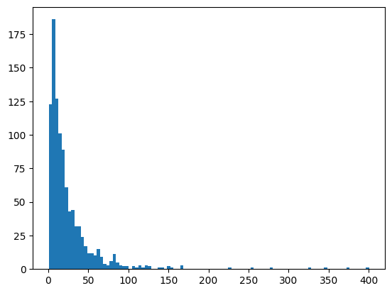
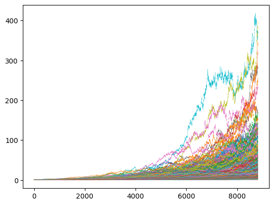

---
date:
    created: 2025-02-01
draft: false
categories:
    - 投資
---

# 現金とオルカンの資産取り崩し（定額）シミュレーション

## シミュレーション用データ作成
トリニティスタデイのシミュレーションでは、1925年から1995年までの市場データに対して、株式/債券の構成と引出し率の組み合わせをテストしていましたが、市場データを1年ずつずらしたデータでは同じようなデータが多くあることになるので、もっとランダムなデータによってシミュレーションを行いたいと思い、テスト用のランダムデータを作ることにしました。
<!-- more -->
MSCI ACWI Index (JPY)の2024末のファクトシートでは、1987年12月以来の年率平均リターンは9.12%で、シャープレシオは0.53なので、リスクは17.21%となります。リターン、リスクについてはこの実績値を用いて、幾何ブラウン運動に基づく35年分のデータを1000セット作ります。計算方法は、[ここ](https://www.pyquantnews.com/the-pyquant-newsletter/how-to-simulate-stock-prices-with-python)を参考にしました。35年としたのは、65歳からを想定しても35年であれば100歳となるので、まあまあ十分かなと思ったからです。もちろん100歳を超えて生きることも想定はしておかないといけないと思います。
実際の計算では、年間取引日を252日として日ごとに計算を行いましたが、以降のシミュレーションではそこから求めた年間のリターン値を使用しています。
出来上がったランダムデータセットの、35年間通してのリターン（元本に対する倍率）をヒストグラムにすると下記のようになります。

{ width="400" }

資産推移をグラフにすると下図のようになります。
35年間通してのリターンが最も高いデータでは、元本は35年間で400倍になり、最も低い場合は、元本割れして元本の0.6倍になります。ちなみに元本割れするケースは1000回のうち3回あり、元本の2倍未満のケースは24回ありました。

{width="400"}

## シミュレーション
下表は、株/現金比率を変えた初期資産に対して、株は上記サンプルデータ(35年間分)1000セットによりリターンを計算し、現金は金利0.6%で、毎年初期資産額の1%～5%を取り崩す（税金・手数料は考慮せず）場合のシミュレーション結果です。上段は1000回のうち35年後も資産が枯渇しない回数、中段は初期資産を1とした場合の最終資産の平均値、下段は資産が枯渇しない年数の平均（カッコ内は資産が枯渇しない最短年数）を示します。将来的な政策金利が1.5%程度になり、追随率40%で預金金利が0.6%になると想定しました。インフレは考慮していません。

| 株/現金比率＼取り崩し率 | 1% | 2% | 3% | 4% | 5% |
| :--: | :--: | :--: | :--: | :--: | :--: |
| 70/30 |1000 8.41 35(35) |1000 7.04 35(35) |985 5.66 34.917(25) |924 4.31 34.404(17) |771 3.06 32.831(14) |
| 60/40 |1000 6.0 35(35) |1000 4.89 35(35) |987 3.78 34.938(27) |905 2.7 34.36(19) |704 1.73 32.399(15) |
| 50/50 |1000 4.24 35(35) |1000 3.34 35(35) |987 2.45 34.952(29) |884 1.58 34.269(20) |606 0.85 31.663(16) |
| 40/60 |1000 2.98 35(35) |1000 2.25 35(35) |987 1.51 34.963(30) |824 0.82 34.062(21) |442 0.31 30.401(16) |
| 30/70 |1000 2.07 35(35) |1000 1.47 35(35) |987 0.87 34.97(31) |680 0.33 33.442(22) |171 0.06 27.88(17) |

株/現金比率が50/50の場合、4%取り崩しでは、成功確率が88.4%で平均年数は34.269年で、最終資産額も平均で元本の1.58倍になり、大体のケースでは大丈夫といえますが、10%以上の場合に35年以内に資産が枯渇するという結果になったので、その点が少し気になりました。取り崩しを3%にすればほぼ大丈夫ですが、全額現金で持っていてれば、3%取り崩しで確実に33年は枯渇しないので、あまり株式投資によるメリットが感じられません。

上記は、毎年決められた株/現金比率にリバランスを行っていますが、より株式のリターンの恩恵を受けるために、リバランスは行わないで、まず現金から取り崩しを行って、現金が底をついたら株式を取り崩すという戦略もあるかと思います。この場合は、年齢とともに株式の割合が増加することになります。その場合のシミュレーション結果を下表に示します。

| 株/現金比率＼取り崩し率 | 1% | 2% | 3% | 4% | 5% |
| :--: | :--: | :--: | :--: | :--: | :--: |
| 70/30 |1000 17.6 35(35) |1000 16.49 35(35) |983 14.69 34.866(22) |939 12.55 34.404(16) |847 10.34 33.308(13) |
| 60/40 |1000 15.19 35(35) |1000 14.48 35(35) |986 13.04 34.907(25) |937 11.21 34.437(17) |836 9.19 33.249(13) |
| 50/50 |1000 12.77 35(35) |1000 12.28 35(35) |989 11.15 34.941(25) |931 9.59 34.437(18) |812 7.82 33.129(14) |
| 40/60 |1000 10.35 35(35) |1000 9.96 35(35) |990 9.1 34.956(27) |919 7.78 34.414(19) |775 6.25 32.834(15) |
| 30/70 |1000 7.92 35(35) |1000 7.57 35(35) |990 6.92 34.968(29) |897 5.83 34.33(21) |721 4.53 32.368(16) |

この場合、株/現金比率が50/50の4%取り崩しでは、成功確率が93.1%、平均年数34.437でリバランスを行うよりも成績が良くなっています。また、最終資産は9.59でリバランスを行ったときの1.55の約6倍です。最短年数は18年でリバランスのときより2年短くなりましたが、全般的に判断して、リバランスを実行するよりも、リバランスは行わずに現金から取り崩した方が良さそうです。

今度は、逆にリバランスを行わないで株式から取り崩す場合をシミュレーションしてみます。この場合は、年齢とともに株式の割合が減少することになります。

| 株/現金比率＼取り崩し率 | 1% | 2% | 3% | 4% | 5% |
| :--: | :--: | :--: | :--: | :--: | :--: |
| 70/30 |1000 15.26 35(35) |1000 12.56 35(35) |961 9.89 34.763(24) |824 7.34 33.603(18) |633 5.12 30.99(14) |
| 60/40 |1000 12.84 35(35) |1000 10.14 35(35) |939 7.49 34.734(25) |739 5.09 33.009(19) |502 3.18 29.548(15) |
| 50/50 |1000 10.42 35(35) |1000 7.72 35(35) |918 5.15 34.694(27) |619 3.02 32.143(20) |337 1.58 27.571(16) |
| 40/60 |1000 7.99 35(35) |1000 5.33 35(35) |870 2.95 34.606(28) |422 1.34 30.731(21) |148 0.5 24.887(17) |
| 30/70 |1000 5.57 35(35) |1000 3.01 35(35) |783 1.15 34.473(30) |168 0.29 28.567(22) |22 0.06 22.047(18) |

株式/現金比率50/50で、4%取り崩しの場合、35年間枯渇しない確率は61.9%で上2つの方法よりもかなり悪いです。最低年数は20年でリバランスする方法と変わりません。この方法は検討に値しない気がします。

一般に、取り崩しの際はリバランスを行った方がよいとか、年齢が高くなるほど株式の比率を下げた方が良いとかいわれていますが、今回の結果は必ずしもその通りにはなりませんでした。
今回の計算では、リバランスは行わずに現金から取り崩して現金がなくなったら株式を取り崩すのが一番良いという結果になりました。まあ、この方法は取り崩しが始まってからは新たな株式投資は一切行わないので、そういう意味では保守的なのかもしれません。リバランスでは、株式割合が減れば、そのたびに株式投資を行うことになりますからね。また、株式と現金の比率が50/50の場合、リバランスを行わないで現金から取り崩すとすると、4%では12年は現金を取り崩すことになるので、その間に株式をフルに運用できるのも大きいのかもしれません。今回は株式のリターンを9.12と見積もっていますがリターンがもう少し小さければまた違った結果になるのかもしれません。この辺はもう少し検証が必要ですね。

仮に4%で取り崩す場合、月5万円ずつ年間60万円を取り崩すには1500万円が必要で、月10万円なら3000万円が必要になります。これは覚えておくとよいですね。3%取り崩しの場合は、月5万円には2000万円必要で、月10万円なら4000万円必要です。