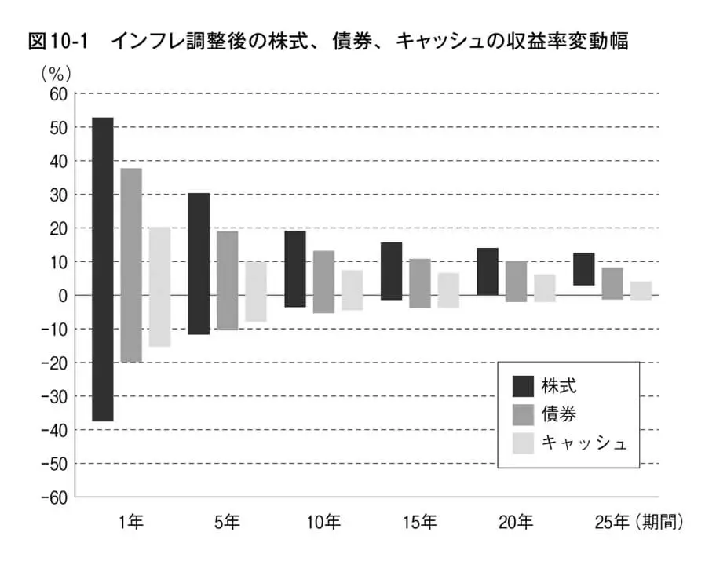

---
date:
    created: 2025-03-04
    
draft: true
categories:
    - 投資
---

# 退職後の資産運用・取り崩しについて再考
先日、65歳までに必要な資産として6600万円が必要という[記事](2025-02-21.md)を書きましたが、少し多すぎるのでもっと減らせないか考えました。
必要資産を減らすには出費を減らすか、運用による資産拡大を増やすかしかありません。（退職後のことを考えているので、収入を増やすことは考えません。）
<!-- more -->

## 退職後の出費を徐々に減らす
年齢を下記のように5年区切りにして、65歳の月額18万円でスタートし、年齢とともに生活をスリム化して、85歳で月額10万円まで生活レベルを落として、以後100歳までを考えてみたところ、5400万円になりました。
前回の記事の6600万円よりは1000万円以上削減できました。月々の出費を抑えた他に、前回は105歳まで考えていましたが、それを100歳までに縮めたのも効いています。終年齢を引き下げたのは、85歳から100歳まで月10万円と金額を減らさずに見積もっているので実際はもっと長持ちしそうなのと、後述する資産運用によりなんとかなるのではというのが理由です。

| 年齢 | 月に必要な額(万円) | 5年間に必要な金額(万円) |
| :--: | :--: | :--: |
| 65～69 | 18 | 1080 |
| 70～74 | 16 | 960 |
| 75～79 | 14 | 840 |
| 80～84 | 12 | 720 |
| 85～90 | 10 | 600 |
| 90～94 | 10 | 600 |
| 95～100 | 10 | 600 |
| 合計 |      | 5400 |

/// Caption
表1. 年齢区間毎の必要金額
///

この5400万円は、あくまで65歳時点での価値での必要額で、この金額を現金で用意しておいてもインフレには勝てないので、株式（インデックス投資）による運用が必要になります。

以下では、現金・株式比率をどの位にすれば良いかを考えます。

## 20年の投資期間があれば株式100%も可能か？
バートン・マルキールの「ウォール街のランダムウォーカー（原著第13版）」の第14章の有名な図によると、S&P500のような株式インデックスでは、20年以上の投資期間があれば資産は最低でも年率5.9%で増加します。最高では、年率平均17.3%にもなります。

{ width="400" }

チャールズ・エリスの「敗者のゲーム」にも似たような図があります。こちらはインフレ調整後の値ですが、20年の投資期間でインフレ調整後であっても株式資産はマイナスにならないことがわかります。（なお、この図の株式がどういったものを指しているかは明記されておらず不明です。）

{ width="400" }

また、少し厳しめにインデックス投資の年率リターンを7%、年率リスクを19%として、正規分布を仮定して投資期間による元本割れ確率と、その値以下である確率が1%となる元本比（1%値）を求めると下表のようになります。（「1%値」が1ということは、元本以下となる確率が1%、「1%値」が0.8ということは、元本の80%以下になる確率が1%ということを示します。）
ここでは、y年の投資期間では、リスクが√y倍になることを利用して計算を行いました。

この計算では、投資期間20年では、元本割れ確率は0%で、99%の確率で元本の1.89倍以上になるという結果になりました。平均的には、年率7%で計算すると20年後には資産は3.87倍になります。

| 投資期間（年） | 元本割れ確率 | 1%値 |
| :--: | :--: | :--: | 
| 1 | 35.6% | 0.63 |
| 5 | 17.2% | 0.41 |
| 10 | 5.4% | 0.57 |
| 15 | 0.98% | 1.05 |
| 20 | 0.0% | 1.89 |
| 25 | 0.0% | 3.21 |

/// Caption
表2. 投資期間と元本割れ確率
///

以上のようなデータから考えると、20年以上の投資期間を確保できるなら、リスクを過度に恐れずに100%をインデックス投資に回しても大丈夫なような気がします。

## 20年未満の投資期間の株式比率はどうするか？
上で示したチャールズ・エリス著の「敗者のゲーム」の図において、1年、5年、10年、15年の投資期間における株式の収益変動幅の下限（年率）は下記の通りになります。下表では年率から計算したそれぞれの投資期間における下限も示しています。さらにその下限値（投資期間）の場合であっても、全資産の損失が10%以内に収まる株式比率を計算して示しました。（株式と現金による運用を考えています。）

| 投資期間（年） | 下限（年率） | 下限（投資期間） | 株式比率 |
| :--: | :--: | :--: | :--: |
| 1 |  -38%| -38% | 26% |
| 5 | -11% | -44% | 23% |
| 10 | -3% | -26% | 38% |
| 15 | -1% | -14% | 71% |
| 20 | 0% | 0% | 100% |

/// Caption
表3. 投資期間と株式比率
///

今、投資期間を5年間隔で考えることにすると、上表での損失10%の株式比率から、
それぞれの期間で損失が10%以内に収まる株式比率として、下表のような比率が
妥当なのではないかと考えました。
（下表では、前項で考察した投資期間20年以上の場合も含めています。）

| 投資期間（年） | 株式比率 |
| :--: | :--: |
| 1-5 | 0% |
| 5-10 | 30% |
| 10-15 | 50% |
| 15-20 | 80% |
| 20- | 100% |

/// Caption
表4. 投資区間（5年区切り）と株式比率
///

## 65歳以降の株式・現金比率を考える
表1.と表4.を組み合わせることにより、65歳時点での最適な株式比率が下記の通り求められます。
株式・現金比率は、57/43になりました。
65歳から69歳の間は、毎月18万円（合計1080万円）を現金から取り崩すことになります。

| 年齢 | 月に必要な額(万円) | 5年間に必要な金額(万円) | 株式比率 |
| :--: | :--: | :--: | :--: |
| 65～69 | 18 | 1080 | 0% |
| 70～74 | 16 | 960 | 30% |
| 75～79 | 14 | 840 | 50% |
| 80～84 | 12 | 720 | 80% |
| 85～89 | 10 | 600 | 100% |
| 90～94 | 10 | 600 | 100% |
| 95～99 | 10 | 600 | 100% |
| 合計 |      | 5400 | 57% |

/// Caption
表5. 65歳時点での株式比率
///

さて、65歳から取り崩しをはじめ、70歳になった時点では、取り崩し額の累計は1080万円になっているはずですが、この70歳時点で、資産がどれくらい残っているかは株式の運用成績次第なのでわかりません。
そこで、70歳以降の取り崩しは、金額ではなくて比率で決めることにします。
また、それぞれの期間の株式比率はその期間にいたるまでの年数を考慮して決めているので、この比率の再調整は行わないことにします。ただし、70歳になったら直近の70～74歳の期間の資産に限って、全て現金化することにします。

| 年齢 | 月に必要な額(万円) | 5年間に必要な金額(万円) | 株式比率 | 当初の現金資産(万円) | 当初の株式資産(万円) |
| :--: | :--: | :--: | :--: | :--: | :--: |
| 70～74 | 16 | 960 | 30% | 672 | 288 |
| 75～79 | 14 | 840 | 50% | 420 | 420 | 
| 80～84 | 12 | 720 | 80% | 144 | 576 |
| 85～89 | 10 | 600 | 100% | 0 | 600 |
| 90～94 | 10 | 600 | 100% | 0 | 600 |
| 95～99 | 10 | 600 | 100% | 0 | 600 |
| 合計 |      | 4320 | 57% | 1236 | 3084 |

/// Caption
表6. 70歳時点での当初想定の必要金額
///

70～74歳で使える金額の計算には、まず、表6.にあるようにそろぞれの期間の当初現金資産、当初株式資産を求め、合計金額に対するその割合を求めます。

**現金割合 = 672 / 1236 = 54.4%**

**株式割合 = 288 / 3084 =  9.3%**

従って、70歳時点で、現金資産総額の54.4%と株式資産総額の9.3%（この9.3%は現金化します）を足した金額が、70～74歳の期間で使用できる金額となります。この金額を75歳を迎えるまでに全額使い切るようにします。

次に、75歳時点での現金割合、株式割合は下記のように計算できます。

**現金割合 = 420 / 564 = 74.5%**

**株式割合 = 420 / 2796 =  15.0%**

従って、75歳時点で、現金資産総額の74.5%と株式資産総額の15.0%（この15.0%は現金化します）を足した金額が、75～79歳の期間で使用できる金額となります。この金額を80歳を迎えるまでに全額使い切るようにします。

| 年齢 | 月に必要な額(万円) | 5年間に必要な金額(万円) | 株式比率 | 当初の現金資産(万円) | 当初の株式資産(万円) |
| :--: | :--: | :--: | :--: | :--: | :--: |
| 75～79 | 14 | 840 | 50% | 420 | 420 | 
| 80～84 | 12 | 720 | 80% | 144 | 576 |
| 85～89 | 10 | 600 | 100% | 0 | 600 |
| 90～94 | 10 | 600 | 100% | 0 | 600 |
| 95～99 | 10 | 600 | 100% | 0 | 600 |
| 合計 |      |  | 57% | 564 | 2796 |

/// Caption
表7. 75歳以降の当初必要金額
///

## まとめ
80歳以降も同様に現金割合、株式割合が計算できます。

以上の手続きをまとめると、65歳で資産5400万円を用意し、現金2316万円、株式3084万円で運用します。
そして69歳までの5年間で現金1080万円を消費します。
70歳以降は、5年おきに、その時点での現金と株式から下表の割合を取り崩して（株式は現金化）、それを5年分の資金とします。

| 年齢 | 現金取り崩し割合 | 株式取り崩し割合 |
| :--: | :--: | :--: | 
| 65 | 46.7% | 0% |
| 70 | 54.4% | 9.3% |
| 75 | 74.5% | 15.0% |
| 80 | 100% | 24.2% |
| 85 | 0% | 33.3% |
| 90 | 0% | 50% |
| 95 | 0% | 100% |

/// Caption
表8. 65歳で資金5400万円（現金2316万円、株式3084万円）とした場合の5年毎の取り崩し割合
///

この方法では、65歳時点での現金・株式比率は43/57ですが、それ以降の比率は株式の運用成績次第です。ただし、年齢とともに株式の割合は高くなり、85歳での株式比率は100%になります（株式取り崩し前）。
この方法だと、5年おきにきめられた比率で取り崩しを行うだけなので手続きとしては非常に簡単です。
また、30年以上の期間の計画になるので、取り崩しを行う5年毎に戦略の見直しを行うこともできるので、
とりあえずこんな感じで始めるのは良いかもしれません。（比率については、さらなる検討が必要かと思います。）
